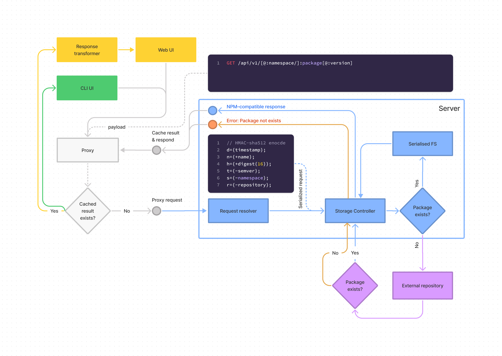

# Architecture concepts

### Package accessing

 

----

 

### Get package

|||
|----|----|
|Method:|`GET`|
|URI:|`/api/v1/[@:namespace/]:package[@:version]`|

Response: **Binary**

 

----

 

### Get package metadata 

|||
|----|----|
|Method:|`GET`|
|URI:|`/api/v1/[@:namespace/]:package[@:version]/meta`|

Response: **Filtered package.json content of package**